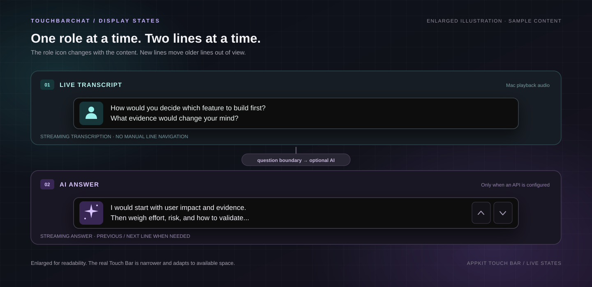
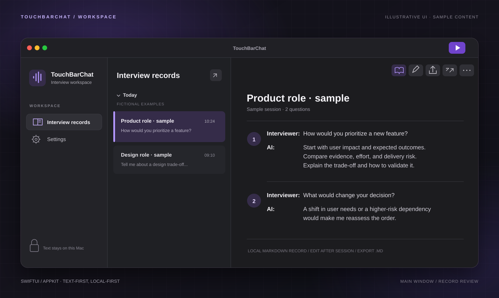

<div align="center">

<sub>MACOS · 设备端语音 · 可选 AI</sub>

# TouchBarChat

### 听清问题，让回答留在眼前。

一款开源 macOS 面试辅助应用：本地转写**这台 Mac 正在播放的声音**，流式展示可选的 AI 回答建议，并把问答保存在可编辑、可导出的记录中。

[](#系统要求)
[](#从源码构建)
[](#工作原理)
[](LICENSE)

[查看使用场景](#使用场景) · [工作原理](#工作原理) · [从源码构建](#从源码构建) · [English](README.md)

</div>



<p align="center"><sub>放大的界面示意，文字为虚构示例，并非设备截图；转录与回答是先后切换，而非同时显示。</sub></p>

人物图标表示**实时转录**，星光图标表示 **AI 回答**。两者都以连续更新的两行窗口展示，不是逐字动画；回答阶段可用轻量的上／下按钮或 `Control + Option + ←/→` 回看，新到文字不会因此丢失。转录阶段不提供翻页。

## 使用场景

| 01 · 本地转写 | 02 · 即时提示 | 03 · 结束复盘 |
| :--- | :--- | :--- |
| Apple 设备端语音把**电脑播放的声音**转成实时文字；不采集麦克风，不保存音频。 | 自行配置 API 后，将参考回答流式送到 Touch Bar 的两行视图；这一步可以完全跳过。 | 本机文字记录保留问答；结束后可编辑、恢复、删除，或导出 Markdown。 |

### 主窗口与面试记录



<p align="center"><sub>基于当前界面的示意图，内容为示例数据，非未经处理的实机截图。</sub></p>

**没有 Touch Bar？** 主窗口记录仍可使用。**没有 API？** 仍可本地转写和保存文字。采集过程中记录只读。

> [!IMPORTANT]
> 请仅在参与者知情，且面试、会议或平台规则允许录制和 AI 辅助时使用。TouchBarChat 无法识别说话人，也无法判断具体使用方式是否被允许；它不用于绕过披露、监考或面试规则。

## 工作原理

`电脑播放声音 → ScreenCaptureKit → Apple 本地语音 → 问答边界判断 → 可选 AI → Touch Bar + 本机记录`

1. **只采集声音。** ScreenCaptureKit 读取电脑播放的声音。显示器只用于建立过滤器；程序不注册视频输出，也不采集麦克风或保存音视频文件。
2. **设备端识别。** 支持时优先使用 macOS 26 的 SpeechAnalyzer／SpeechTranscriber；否则仅在 `SFSpeechRecognizer` 支持本地识别时使用旧路径，不会悄悄转用云端语音。
3. **判断何时回答。** 结合本机声音活动、Apple SoundAnalysis、文字稳定性和问题特征推断提问结束。这不是说话人识别；菜单栏也提供“手动生成当前回答”。
4. **流式展示和保存。** 配置 AI 后，Chat Completions 兼容接口接收文字上下文并返回建议。转录与回答随到随显示、写入本机记录；打断、迟到回答和部分回复详见[面试流程设计](Docs/InterviewFlowDesign.md)与[实时链路说明](Docs/InterviewRuntime.md)。

<details>
<summary>开发者源码导览</summary>

| 职责 | 入口 |
| --- | --- |
| 系统播放声音采集 | [`SystemAudioCapture.swift`](Sources/TouchBarChat/SystemAudioCapture.swift) |
| 本地语音引擎选择 | [`LocalSpeechTranscriber.swift`](Sources/TouchBarChat/LocalSpeechTranscriber.swift) |
| 提问结束与打断判断 | [`InterviewQuestionEndPolicy.swift`](Sources/TouchBarChat/InterviewQuestionEndPolicy.swift)、[`InterviewInterruptionPolicy.swift`](Sources/TouchBarChat/InterviewInterruptionPolicy.swift) |
| AI 流式请求 | [`AIAnswerClient.swift`](Sources/TouchBarChat/AIAnswerClient.swift) |
| Touch Bar 与主窗口 | [`TouchBarController.swift`](Sources/TouchBarChat/TouchBarController.swift)、[`AppUIController.swift`](Sources/TouchBarChat/AppUIController.swift) |
| 本机文字记录 | [`InterviewStore.swift`](Sources/TouchBarChat/InterviewStore.swift) |

</details>

## 多语言

界面提供简体中文、英语、韩语、日语、俄语、法语和巴西葡萄牙语资源。可在“**设置 → 语言**”中跟随 macOS，或手动选择其中一种语言；未覆盖的文字目前仍可能回退为简体中文。

转写语言和 AI 回答语言独立设置：

| 层次 | 行为 |
| --- | --- |
| 界面 | 默认跟随 macOS，也可在设置中指定语言。 |
| 面试官转写 | 可选 `zh-CN`、`en-US`、`ko-KR`、`ja-JP`、`ru-RU`、`fr-FR`、`pt-BR`，但必须由**当前 Mac 上的 Apple 设备端识别**支持。 |
| AI 回答 | 默认跟随面试官语言，也可另外指定；这是向所配模型提出的要求，模型不一定完全遵守。 |
| 历史记录 | 保留面试语言对应的标签，更改界面语言不会重新标记旧文档。 |

设置中列出某种语言，**不表示**其 Apple 模型已经安装、在所有 Mac 上可用，或已通过真实会议音频验证。程序会在采集前检查本地识别能力；不可用时明确失败，不会把音频送给远程识别服务。

## 系统要求

| 项目 | 要求与验证范围 |
| --- | --- |
| macOS | Swift 包最低要求为 **13**。开发与自动测试运行于 macOS **26.7**；打包应用在 macOS 13–25 与其他机型上仍需分别实机验证。 |
| 开发工具 | Xcode 或 Apple Command Line Tools，需支持 Swift 6。 |
| 语音模型 | 所选语言须在当前 Mac 上支持 Apple 设备端识别；首次使用可能要下载模型。 |
| Touch Bar | 可选。展示依赖**未公开的 AppKit 接口**，未来 macOS 版本可能不兼容；主窗口记录仍可使用。 |
| AI | 可选；由用户提供 Chat Completions 兼容接口。服务费用、可用性、数据留存和输出质量不由本项目保证。 |

## 快速开始

### 从源码构建

在仓库根目录执行：

```bash
./Scripts/check.sh
./Scripts/build-app.sh
open Build/TouchBarChat.app
```

`check.sh` 运行严格的 Swift 格式检查与测试套件，但不能代替各语言实机转写或实体 Touch Bar 测试。`build-app.sh` 生成 `Build/TouchBarChat.app`，**默认使用临时签名**，不会自动读取或选择本机开发者证书。如需稳定的开发签名，请显式指定：

```bash
TOUCHBARCHAT_SIGN_IDENTITY="Apple Development: Your Name (TEAMID)" ./Scripts/build-app.sh
```

这里的身份名称只是占位示例，不是项目凭据。测试 macOS 隐私权限时，尽量保持应用路径、标识（`dev.touchbarchat.app`）和签名身份稳定；临时签名重建后可能需要重新授权。请勿提交证书、描述文件、密钥、面试记录或本机签名的构建产物。

### 首次使用

1. 完成“**权限 → AI 接口 → 回答偏好 → 欢迎**”引导，选择面试官语言，允许“**屏幕与系统音频录制**”。旧版 `SFSpeechRecognizer` 路径还可能请求“**语音识别**”权限；受支持的 macOS 26 SpeechTranscriber 路径不使用该权限。
2. 若需要 AI，填写**完整 Chat Completions URL**、准确模型名、API Key 与个人背景。远程地址必须使用 HTTPS；只有本机回环地址允许 HTTP。远程接口必须提供 Key，本机回环接口可以不填。也可以跳过，使用纯转写模式。
3. 点击主窗口的开始图标。程序先检查权限、本地语音能力及已经填写的 API 设置，再启动采集、最小化窗口并出现菜单栏入口。
4. 在菜单栏**暂停、继续、结束、手动生成当前回答**或**重新打开窗口**。结束面试后再编辑、删除或导出 Markdown 记录。

## 隐私与数据流向

| 数据 | 去向 |
| --- | --- |
| 电脑播放的声音 | ScreenCaptureKit 与 Apple 本机语音／声音分析框架在 Mac 上处理；TouchBarChat 不保存音频，也不把音频发给所配置的 AI 接口。首次下载 Apple 本地语音模型可能需要联网。 |
| 面试文字 | 默认保存在 `~/Library/Application Support/TouchBarChat/interviews.json`。这是**本机未加密的文字文件**，不是保密保险箱；导出的 Markdown 保存到用户指定位置。记录不会自动上传到 GitHub。 |
| API 配置 | API Key 保存在 macOS 钥匙串；接口地址、模型名和个人背景存在本机用户设置中，而非源码中。 |
| 可选 AI 请求 | 所选接口会收到当前问题、个人背景及最多三组近期问答草稿；配置 Key 时还会收到 Bearer 凭据。服务商可能根据自身条款处理或留存这些文字。 |

使用前请核对面试规则与 API 服务商的隐私政策。提交截图、日志、Issue 或 Pull Request 前，请去除姓名、密钥与真实面试内容。

## 已知局限

- 采集范围是**符合系统过滤条件的 Mac 播放声音**，可能包含会议参与者、视频、音乐或通知；无法判断谁在说话，也不会采集你对麦克风说的话。
- 本地识别的质量和可用语言取决于 Apple 模型、设备、系统版本及音质。临时转写可能回改，最终结果可能迟到或漏字。
- 提问结束和打断判断属于启发式推断。`SpeechDetector` 当前不作为结束信号；原因与实测见[设计文档](Docs/InterviewFlowDesign.md#参考与取舍)。
- AI 输出可能延迟、错误、不完整，或与用户真实经历不符；只能作为参考，不能当作已核实事实。
- Touch Bar 使用未公开 AppKit selector，当前方式不适合直接进入 Mac App Store；这里也没有提供公证过的发行版。
- 本地记录没有加密；启用 AI 后，**文字**会发送给用户选择的服务商。

## 常见问题

| 现象 | 优先检查 |
| --- | --- |
| 系统权限列表里没有 TouchBarChat | 先从应用内请求权限，再打开 macOS 隐私设置；系统提示重启时，重新打开**同一签名的应用**。测试期间不要替换成不同签名的构建。 |
| 显示“正在识别”但没有字 | 确认声音是从**这台 Mac** 的会议软件或浏览器播放，而不是只对着麦克风讲话；检查面试语言与本地模型可用性。 |
| 转写慢或漏字 | 检查会议播放音量、音质和所选语言。临时结果会回改，最终结果可能较晚到达；反馈问题时只提供不含隐私的短句。 |
| 没有 AI 回答 | 检查完整 Chat Completions URL、模型名和 API 设置；自动判断等待过久时可尝试菜单栏手动生成。 |
| Touch Bar 不显示 | 检查机器是否有 Touch Bar 及系统接口是否仍受支持；主窗口记录是降级路径。`swift run TouchBarChat --probe` 只检查 selector 是否存在，不启动面试。 |
| 重新构建后权限失效 | 尽量使用固定的应用路径、标识和签名身份；临时签名不保证保留 TCC 授权。 |

## 参与开发

`./Scripts/check.sh` 覆盖格式检查，以及设置校验、文字持久化、问答边界、AI 流式响应和 Touch Bar 翻页等自动测试。它**不能替代**在参与者知情、内容不涉隐私的前提下开展各语言与实体 Touch Bar 测试。贡献规范见 [CONTRIBUTING.md](CONTRIBUTING.md)，设计参考与第三方声明见 [THIRD_PARTY_NOTICES.md](THIRD_PARTY_NOTICES.md)；当前 Swift 包不链接第三方库。

项目采用 [MIT 许可](LICENSE)。
